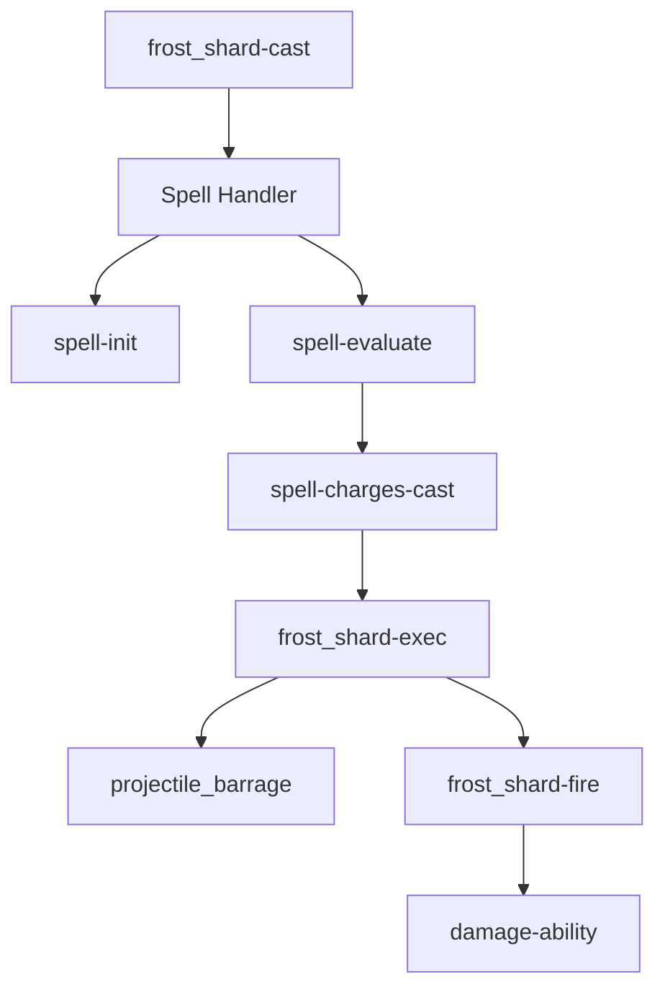

## Overview

Nesting is the practice of calling one module from within another, creating layers of functionality. This is where IonTech's Modular Systems truly shines—by composing simple modules, you can build incredibly complex spell behaviors.

<Note>
Every module is designed to integrate with all other modules. This isn't accidental—it's the core design principle.
</Note>

## Basic Nesting

The simplest form of nesting is calling one module from another:

```yaml
# Level 1: Your spell
my_spell-cast:
  Skills:
  - skill:Spell{id=my_spell;name=My Spell;spellcd=100}

# Level 2: Spell Handler (called automatically)
spell-cast:
  Skills:
  - vskill{s=<skill.var.id>}  # Calls your actual spell logic
  - skill{s=spell-cooldown}    # Applies cooldown
```

When you call `skill:Spell{...}`, you're actually nesting your logic inside the Spell Handler module, which provides:
- Cooldown management
- Charge systems
- Channeling/warmup
- Cast validation
- VFX and sound effects

## Understanding Execution Flow

### Example: Frost Shard

Let's trace how `frost_shard` executes through nested modules:

```yaml
# LEVEL 1: Initial cast
frost_shard-cast:
  Skills:
  - skill:Spell{id=[ - vskill{s=frost_shard-exec;branch=true} ];
      name=Frost Shard;
      charges=8;chargecd=2;chargedelay=0.75}
```

**Execution path:**

<Steps>
  <Step title="Player triggers cast">
    The item or input handler calls `frost_shard-cast`
  </Step>
  
  <Step title="Spell Handler takes over">
    `skill:Spell` redirects to the Spell Handler module:
    
    ```yaml
    spell:
      Skills:
      - skill{s=spell-init}      # Initialize variables
      - skill{s=spell-evaluate}  # Check conditions
    ```
  </Step>
  
  <Step title="Validation checks">
    ```yaml
    spell-evaluate:
      Conditions:
      - hasaura{name=stun} false  # Not stunned?
      - varequals{var=charges;val=0} castinstead spell-on_cooldown
    ```
  </Step>
  
  <Step title="Execute spell logic">
    Since charges > 0, executes the `id` parameter:
    
    ```yaml
    spell-charges-cast:
      Skills:
      - vskill{s=<skill.var.id>}  # Runs frost_shard-exec
    ```
  </Step>
  
  <Step title="Your logic runs">
    ```yaml
    frost_shard-exec:
      Skills:
      - skill:projectile_barrage{...}  # Nest another module!
    ```
  </Step>
</Steps>

### Visualization



## Common Nesting Patterns

### Pattern 1: Spell → Projectile → Damage

The most common pattern in the demo spells:

```yaml
# LEVEL 1: Spell Handler
frost_shard-cast:
  Skills:
  - skill:Spell{id=[ - vskill{s=frost_shard-exec} ];...}

# LEVEL 2: Projectile Logic
frost_shard-exec:
  Skills:
  - skill:projectile_barrage{id=frost_shard-fire;...} @forward{...}

# LEVEL 3: Projectile Mechanics
frost_shard-fire:
  Skills:
  - skill:setRandomID          # Damage tracking module
  - projectile{onHit=frost_shard-hit_entity;...}

# LEVEL 4: Damage Handler
frost_shard-hit_entity:
  Skills:
  - skill:damage-ability{immune=10;...}  # Damage Core module
```

**Why this structure?**
- **Level 1** handles player interaction (cooldowns, charges, casting)
- **Level 2** handles spell behavior (firing projectiles)
- **Level 3** handles projectile mechanics (movement, VFX)
- **Level 4** handles combat resolution (damage, effects)

Each level can be modified independently without breaking the others.

### Pattern 2: Spell → Channel → Execute

For spells with warmup/channeling:

```yaml
# LEVEL 1: Spell Handler with channeling
burning_blast-cast:
  Skills:
  - skill:Spell{id=burning_blast;
      warmup=0.6;                        # Trigger channeling
      onChannelStart=burning_blast-exec; # Execute when ready
      onChannelTick=[
        - vskill{s=channel-tick_fx}
        - potion{t=SLOWNESS;l=2;duration=4}
      ]}

# LEVEL 2: Spell execution after channel
burning_blast-exec:
  Skills:
  - skill:burning_blast-fire{...} @forward{...}

# LEVEL 3: Projectile with tracking
burning_blast-fire:
  Skills:
  - skill:setRandomID
  - projectile{onStart=burning_blast-start;  # Nested callbacks!
      onTick=burning_blast-tick;
      onHit=burning_blast-hit_entity;...}

# LEVEL 4: Complex projectile behavior
burning_blast-start:
  Skills:
  - wait{c=[ - hasaura{aura=<skill.var.id>-channel} false ]}
  - modifyprojectile{t=VELOCITY;a=SET;v=12}

# LEVEL 5: Damage on hit
burning_blast-hit_entity:
  Skills:
  - skill:damage-ability{damageMod=[ - variableMath{var=damage;equation="x*2.5"} ]}
```

**Execution timeline:**
1. Player starts cast → Spell Handler begins channel (0.6s)
2. `onChannelStart` fires projectile immediately
3. Projectile waits for channel to complete (`onStart`)
4. After channel, projectile accelerates and homes
5. On hit, deals 250% damage via Damage Core

### Pattern 3: Damage → Nested Effects

Nesting modules inside the `onHit` parameter:

```yaml
glacial_spikes-hit_entity:
  Skills:
  - skill:damage-ability{
      damageMod=[ - variableMath{var=damage;equation="x*1.75"} ];
      onHit=[                           # Nest multiple modules
      - freeze{t=60}                    # Vanilla effect
      - vskill{s=knockback;v=2;vy=0.5;vertical=false}  # Knockback module!
      ]}
```

Here, the Damage Core module executes:
1. Apply damage modifiers
2. Deal damage
3. Execute `onHit` skills
4. Call nested Knockback module
5. Display damage indicator

## Advanced Nesting Techniques

### Technique 1: Recursive Calls

`frost_shard` uses recursion to fire multiple projectiles:

```yaml
frost_shard-cast:
  Skills:
  - skill:Spell{charges=8;...}  # 8 charges available

frost_shard-exec:
  Skills:
  - skill:projectile_barrage{...}
  - delay 1
  - skill:frost_shard-cast      # Recursively call the spell!
```

**Result:** The spell casts itself repeatedly until all charges are consumed, creating a rapid-fire effect.

<Warning>
Be careful with recursion! Always have a termination condition (in this case, running out of charges) or you'll create infinite loops.
</Warning>

### Technique 2: Branching Execution

The `branch=true` parameter allows parallel execution:

```yaml
frost_shard-cast:
  Skills:
  - skill:Spell{id=[ - vskill{s=frost_shard-exec;branch=true} ];...}
```

Without `branch=true`, the spell would wait for `frost_shard-exec` to complete before continuing. With it, execution continues immediately.

**Use cases:**
- Firing projectiles without blocking
- Applying effects asynchronously
- Running multiple parallel processes

### Technique 3: Callback Nesting

`burning_blast` demonstrates complex callback nesting:

```yaml
burning_blast-cast:
  Skills:
  - skill:Spell{
      onChannelStart=burning_blast-exec;  # Callback 1
      onChannelTick=[                     # Callback 2 (inline)
        - vskill{s=channel-tick_fx}
        - potion{t=SLOWNESS;l=2;duration=4}
      ]}

burning_blast-fire:
  Skills:
  - projectile{
      onStart=burning_blast-start;        # Nested callback 1
      onTick=burning_blast-tick;          # Nested callback 2
      onHit=burning_blast-hit_entity}     # Nested callback 3
```

Callbacks within callbacks create sophisticated behaviors:
- Spell Handler's `onChannelStart` fires a projectile
- That projectile has its own `onStart`, `onTick`, `onHit` callbacks
- The `onHit` callback calls the Damage Core
- Which has its own `onHit` callback for status effects

### Technique 4: Module Chains

`glacial_spikes` shows how to chain multiple projectiles:

```yaml
glacial_spikes-target:
  Skills:
  - skill:setRandomID              # Module 1: Damage tracking
  - projectile{                    # Module 2: Main projectile
      onTick=[
      - skill{s=glacial_spikes-fire;...;branch=true}  # Module 3: Sub-projectiles
      ]}

glacial_spikes-fire:
  Skills:
  - projectile{                    # Module 4: Sub-projectile
      onHit=glacial_spikes-hit_entity}  # Module 5: Damage handler

glacial_spikes-hit_entity:
  Skills:
  - skill:damage-ability{          # Module 6: Damage Core
      onHit=[
      - vskill{s=knockback;...}    # Module 7: Knockback Core
      ]}
```

**Execution flow:**
1. Main projectile travels forward
2. Each tick, spawns sub-projectiles upward
3. Sub-projectiles arc down
4. On hit, deal damage and knockback

Seven modules working together to create a single spell effect!

## Real-World Example: Building a Custom Spell

Let's build a spell from scratch using nested modules:

<Tabs>
  <Tab title="Goal">
    **Thunderstrike Spell:**
    - 5 second cooldown
    - 1 second warmup
    - Fires a lightning bolt at cursor
    - Deals 200% damage
    - Stuns for 2 seconds
    - Knocks back enemies
  </Tab>
  
  <Tab title="Level 1: Cast">
    ```yaml
    thunderstrike-cast:
      Skills:
      - skill:Spell{id=thunderstrike;
          name=Thunderstrike;
          type=ABILITY,LIGHTNING;
          spellcd=100;              # 5 seconds
          warmup=20;                # 1 second
          onChannelStart=thunderstrike-exec}
    ```
    
    Uses the Spell Handler module for cooldown and channeling.
  </Tab>
  
  <Tab title="Level 2: Execute">
    ```yaml
    thunderstrike-exec:
      Skills:
      - skill:thunderstrike-fire{origin=@selfeyelocation} @cursor{...}
    ```
    
    Fires the projectile from player eye to cursor location.
  </Tab>
  
  <Tab title="Level 3: Projectile">
    ```yaml
    thunderstrike-fire:
      Skills:
      - skill:setRandomID           # Damage tracking module
      - projectile{velocity=60;     # Fast projectile
          onTick=thunderstrike-tick;
          onHit=thunderstrike-hit_entity;...}
    
    thunderstrike-tick:
      Skills:
      - e:p{p=electric_spark;a=3}   # Lightning particles
    ```
    
    Uses setRandomID module and custom VFX.
  </Tab>
  
  <Tab title="Level 4: Damage">
    ```yaml
    thunderstrike-hit_entity:
      Skills:
      - skill:damage-ability{immune=20;
          damageMod=[ - variableMath{var=damage;equation="x*2"} ];
          onHit=[
          - aura{name=stun;duration=40}           # 2 second stun
          - vskill{s=knockback;v=3;vy=0.8}        # Knockback module
          - e:p{p=explosion;a=1}                  # VFX
          - sound{s=entity.lightning_bolt.impact}
          ]}
    ```
    
    Nests Damage Core and Knockback Core modules.
  </Tab>
</Tabs>

**Final nesting structure:**
```
thunderstrike-cast (Spell Handler)
└── thunderstrike-exec
    └── thunderstrike-fire (setRandomID)
        └── thunderstrike-hit_entity (Damage Core)
            └── knockback (Knockback Core)
```

Five distinct modules working together to create one spell!

## Common Pitfalls

<Accordion title="Pitfall 1: Circular Dependencies">
  **Problem:**
  ```yaml
  spell_a:
    Skills:
    - skill:spell_b
  
  spell_b:
    Skills:
    - skill:spell_a  # Infinite loop!
  ```
  
  **Solution:** Always ensure nesting has a termination condition. The Spell Handler prevents this with cooldowns and charge systems.
</Accordion>

<Accordion title="Pitfall 2: Missing branch=true">
  **Problem:**
  ```yaml
  my_spell:
    Skills:
    - skill:damage-ability{...}  # Blocks execution
    - sound{s=...}               # Never plays!
  ```
  
  **Solution:** Use `branch=true` when you don't need to wait:
  ```yaml
  my_spell:
    Skills:
    - skill{s=damage-ability;branch=true}
    - sound{s=...}  # Plays immediately
  ```
</Accordion>

<Accordion title="Pitfall 3: Variable Scope Issues">
  **Problem:**
  ```yaml
  spell_a:
    Skills:
    - setvar{var=myvar;val=10}
    - skill:spell_b  # Can spell_b access myvar?
  ```
  
  **Solution:** Use the correct variable scope:
  - `skill.var.myvar` - Accessible only within current skill tree
  - `caster.var.myvar` - Accessible across all skills for this caster
  
  Most modules use `skill.var` for internal state and `caster.var` for shared state.
</Accordion>

<Accordion title="Pitfall 4: Nested Modifiers">
  From the README:
  > "Do make sure not to call a modifier within a modifier, you will nuke your server."
  
  The Modifier Handler isn't designed for recursion. Don't nest modifiers inside other modifiers!
</Accordion>

## Debugging Nested Modules

### Technique 1: Message Breadcrumbs

```yaml
my_spell-cast:
  Skills:
  - message{m="[1] Casting spell"}
  - skill:Spell{...}

my_spell-exec:
  Skills:
  - message{m="[2] Executing spell"}
  - skill:projectile_barrage{...}

my_spell-fire:
  Skills:
  - message{m="[3] Firing projectile"}
```

Trace execution flow by watching chat messages.

### Technique 2: Conditional Debug Mode

```yaml
my_spell-cast:
  Skills:
  - skill:Spell{id=my_spell;debug=true;...}

my_spell-exec:
  Skills:
  - message{m="Damage: <skill.var.damage>"} ?varequals{var=debug;val=true}
```

Only shows debug messages when `debug=true`.

### Technique 3: Particle Markers

```yaml
my_spell-hit:
  Skills:
  - e:p{p=villager_happy;a=10}  # Green particles = hit registered
  - skill:damage-ability{...}
```

Visual confirmation that each nested level executes.

## Best Practices

<Note>
**Keep nesting intentional.** Every level should serve a purpose:
- Spell Handler: Player interaction
- Your logic: Spell behavior
- Core modules: Reusable mechanics
- Callbacks: Conditional behavior
</Note>

### 1. Name Consistently

Use a naming convention that shows nesting:

```yaml
thunderstrike-cast          # Entry point
thunderstrike-exec          # Main logic
thunderstrike-fire          # Projectile spawn
thunderstrike-tick          # Projectile behavior
thunderstrike-hit_entity    # Hit detection
```

### 2. Document Complex Nesting

```yaml
# Execution flow:
# 1. glacial_spikes-cast (Spell Handler)
# 2. glacial_spikes-exec (Fires main projectile)
# 3. glacial_spikes-target (Main projectile spawns sub-projectiles)
# 4. glacial_spikes-fire (Sub-projectiles arc downward)
# 5. glacial_spikes-hit_entity (Damage Core + Knockback Core)
```

### 3. Separate Concerns

Each nested level should handle one responsibility:

```yaml
# Good - each skill has one job
spell-cast:      # Handle player input
spell-exec:      # Fire projectile
spell-hit:       # Deal damage

# Bad - mixing concerns
spell-cast:
  Skills:
  - skill:Spell{...}
  - projectile{...}        # Should be in separate skill
  - damage{...}            # Should be in separate skill
```

## Next Steps

<Card title="Spell Handler Reference" icon="wand-magic-sparkles" href="/skill-handlers/spell-casting">
  Deep dive into the core Spell Handler module
</Card>

<Card title="Damage Core Reference" icon="burst" href="/skill-handlers/damage-core">
  Learn about percentage-based damage handling
</Card>